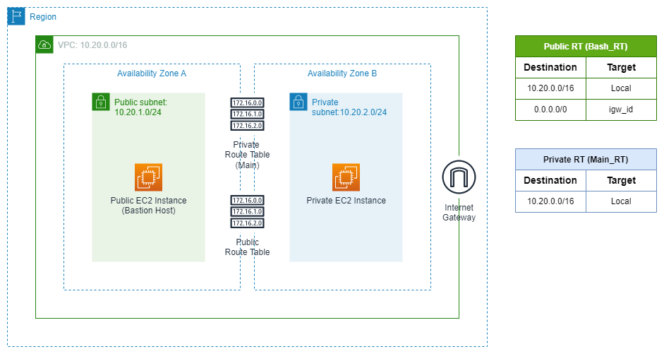

# Automatic Deployment of AWS Resources Using the AWS CLI
## Information
The AWS Command Line Interface (CLI) is an open-source tool to communicate with AWS resources and services using a command-line interface. You can manage all AWS services and control their behavior using this tool. You can also use CLI to automate AWS infrastructure resource and service management.

I created this script (create_resources.sh) as a learning exercise to familiarize myself with the detailed configuration steps required to create various AWS resources while leveraging the AWS CLI. This shell script performs the following actions:

* Creates and names a VPC
* Creates and names an internet gateway
* Creates and names public & private subnets
* Auto-assigns public ip addresses to the public subnet
* Creates and names security groups with different allow rules
* Creates and names a public route table
* Adds a route to the internet gateway
* Associates the public subnet with the public route table
* Creates and names public & private instances

Below is an architecture diagram of the solution deployed by the bash shell script. You can use this solution when you have a server which you do not want to be accessible via the public internet.

This solution saves you money because you do not use a NAT Instance or Gateway to communicate with the private server. You can use the Bastion Host to SSH into the private server instead. You can modify the private server's security group to restrict both inbound and outbound traffic. The subnet's NACL also provides an extra layer of security for your servers. 

The best thing about this architecture is that it is absolutely free! All you need is your [AWS free tier account](https://aws.amazon.com/free/?all-free-tier.sort-by=item.additionalFields.SortRank&all-free-tier.sort-order=asc&awsf.Free%20Tier%20Types=*all&awsf.Free%20Tier%20Categories=*all) to try it out!

## Cleaning Up Your Environment
Remember to clean up your environment so as to not incur any unexpected costs. Use the clean_up_resources.sh script to do this.

## More on the AWS CLI?
AWS provides excellent [documentation](https://aws.amazon.com/cli/) for installing and configuring the AWS CLI. For a more in-depth introduction to the tool, I recommend using their documentation.
You can also check out [this](https://www.youtube.com/watch?v=PWAnY-w1SGQ&t=1369s) video for a quick rundown of the AWS CLI basics.